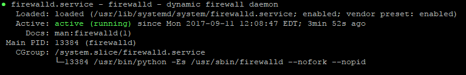
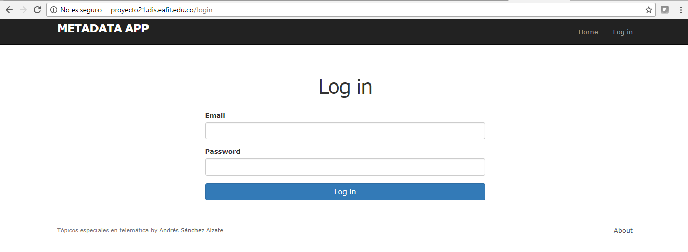
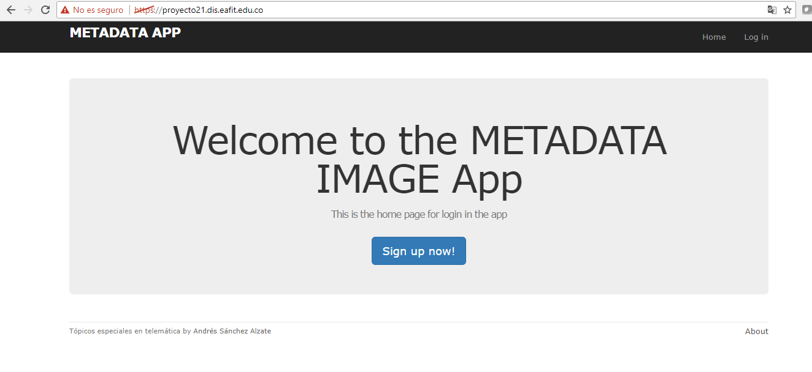

## By: Edwin Montoya - Carlos Andres Sanchez - German - Sebastian Galeano - Jeniffer María

# QA Disponibilidad::

##DB SERVER MASTER/MASTER

Los servidores escogidos para las bases de datos son 10.131.137.176 db1    / 10.131.137.214 db2 en la base de datos se trabajó con MySQL y se realizó una configuración master / master para que los datos que se creen en un nodo se encuentren disponibles en el otro nodo esta configuración añade redundancia y aumenta la eficiencia cuando se trata de acceder a los datos.

Para dicha configuración se siguieron los siguientes pasos:
https://www.digitalocean.com/community/tutorials/how-to-set-up-mysql-master-master-replication

###DB1

**1.  Instalar y Configurar MYSQL **

  a. sudo apt-get install mysql-server mysql-client
  
**2. Editar /etc/mysql/my.cn**

**3. Reiniciar MySQL**

  a.  sudo service MySQL restart

**4. crear un pseudo-usuario que se utilizará para replicar datos entre nuestros dos VPS**

  a. create user 'replicator'@'%' identified by 'password';

**5. Dar permisos al usuario para replicar los datos de MySQL**

  a. grant replication slave on *.* to 'replicator'@'%'; 
  
**6. Obtener información de la instancia de MySQL**

  a. show master status;
  

Para probarlo se creó una tabla en la base de datos desde uno de los servidores y posteriormente se consultó  la tabla desde el otro servidor 


###DB2

**1.  Instalar y Configurar MYSQL**
  a. sudo apt-get install mysql-server mysql-client
  
**2. Editar**
  
  /etc/mysql/my.cn

**3. Reiniciar MySQL**

  a.  sudo service MySQL restart
  
**4. crear un pseudo-usuario que se utilizará para replicar datos entre nuestros dos VPS**
  
  a. create user 'replicator'@'%' identified by 'password';
  
**5. Crear Base de Datos**
  
  a. create database example; 
  
**6. Dar permisos al usuario para replicar los datos de MySQL**
  
  a. grant replication slave on *.* to 'replicator'@'%';
  
**7. Tomar la información de la instancia de DB1**
  
  a. slave stop;
  
  b. CHANGE MASTER TO MASTER_HOST = 'db1', MASTER_USER = 'replicator', MASTER_PASSWORD = 'password', MASTER_LOG_FILE = 'mysql-bin.000001', MASTER_LOG_POS = 107; 

  c. slave start;

**8. Observar el log file y la posición de db2 para replicar en db1**

  a. SHOW MASTER STATUS; 


# QA Rendimiento::

Para garantizar que se cumpla el QA de rendimiento se implementaron tecnicas de cache para el el almacenamiento de Posts en la memoria cache y se utilizó la compresión de imagenes y redimencionamiento para la publicación de las mismas.

##Cache con Redis

Para la implementación de técnicas de chache se usa Redis, quien es un motor de base de datos en memoria, basado en el almacenamiento en tablas de hashes (clave/valor).

Cuando Redis se utiliza como un caché, a menudo es útil para permitir que se desecha automáticamente de los datos antiguos almacenados en memoria a medida que se agregan nuevos.

Para instalar redis en ruby debemos colocar las siguientes gemas en el Gemfile:

```ruby
  gem 'readthis'
  gem 'redis-rails'
  gem 'hiredis' # Highly recommended
  gem 'redis-rack-cache'
  gem 'diplomat', '~> 2.0', '>= 2.0.2'
```

La gema de diplomat se mensiona ya que para acceder al nodo del servidor que tiene instalado Redis lo hacemos por medio de Consul, quien nos dará la dirección del servidor para comunicarnos con Redis dentro de la aplicación. 

```ruby
require_relative 'boot'

require 'rails/all'

# Require the gems listed in Gemfile, including any gems
# you've limited to :test, :development, or :production.
Bundler.require(*Rails.groups)

module Proyecto11
  class Application < Rails::Application
    
  	Diplomat.configure do |config|
  		host = ENV["CONSUL_HOST"]
  		port = ENV["CONSUL_PORT"]
  
      .............................
      
      
  	end
      
    hostname = Diplomat::Service.get('redis').Address
    port = Diplomat::Service.get('redis').ServicePort
  
  	config.cache_store = :redis_store, "redis://#{hostname}:#{port}/0/cache", { expires_in: 90.minutes }
	
  end
end
```

Vemos como con diplomat le pedimos a consul el nombre del host (hostname) y el puerto (port), por el cual nos conectaremos con Redis. Posteriormente creamos una nueva instancia de redis que nos permita hacer uso de la cola que administra la cache.

En la aplicación Redis se usa para guardar la información de los posts de los usuarios cuando estos quieren ingresan a página principal.

Para implementar el sistema de colas, debemos preguntar si el usuario ya accedió a la base de datos para pedir los datos, ya que la primera vez la base de datos debe ser accedida para traer la información y luego guardarla en cache.

```ruby
require "redis"
require "json"

class StaticPagesController < ApplicationController
  def home
  	hostname = Diplomat::Service.get('redis').Address
    port = Diplomat::Service.get('redis').ServicePort
  	redis = Redis.new(host: hostname, port: port, db: 0)
  	@micropost  = current_user.microposts.build if logged_in?
  	if params[:search]
  		if !@feed_items 
    		@feed_items = current_user.feed_search(params[:search]).paginate(page: params[:page]) if logged_in?
    		@feed_items = redis.set "users", @feed_items
    	else
    		@feed_items
    	end
  	else
  		if !@feed_items
	    	@feed_items = current_user.feed.paginate(page: params[:page]) if logged_in?
	    	redis.set "users", @feed_items
	    else
	    	@feed_items
	    end 
  	end
  end

  def help
  end

  def about
  end
end
```

Con redis.set accedemos a la cola que depositará nuestros datos en cache.

##Compresión de datos y redimensionamiento

El rendimiento en la carga de una aplicación puede verse afectado cuando los usuarios suben imagenes muy grandes o con altas resoluciones, por eso para que este proceso sea más liviano en cuanto a la carga y descarga de imagenes por medio de las peticiones que hace el usuario, se usarán algunas gemas que nos provee ruby para ralizar este proceso. Las gemas son las siguientes:

```ruby
gem 'carrierwave',             '1.1.0'
gem 'mini_magick',             '4.7.0'
gem 'fog',
```

En la clase que uploader que se encuentra en la ruta app/uploaders/picture_uploader.rb, debemos llamar el metodo resize to fit, el cual nos permitirá reducir el tamaño de la imagen y comprimirla, ya que este metodo esta diseñado para que las imagenes cumplan con condiciones optimas para guardar imagenes dentro de los servidores.

```ruby
class PictureUploader < CarrierWave::Uploader::Base
  include CarrierWave::MiniMagick
  process resize_to_limit: [400, 400]

  storage :file

  # Override the directory where uploaded files will be stored.
  # This is a sensible default for uploaders that are meant to be mounted:
  def store_dir
    "uploads/#{model.class.to_s.underscore}/#{mounted_as}/#{model.id}"
  end

  # Add a white list of extensions which are allowed to be uploaded.
  def extension_white_list
    %w(jpg jpeg gif png)
  end
end
```

##Medición del rendimiento con Jmeter

Para medir el rendimeinto y el comportamiento funcional de la aplicación y sus medidas de respuesta, usaremos la herramienta Jmeter, la cual nos permite automatizar este proceso y visializar por medio de gráficas, tablas, entre otras, como se comporta la aplicación en un entorno de producción por medio de la simulacion del uso de recursos de la aplicación con muchos usuarios.

Para instalar Jmeter debemos ingresar a http://jmeter.apache.org/download_jmeter.cgi y descagar los códigos fuentes o descargar los binarios.

una vez hayamos descargado el binario cuyo nombre es similar a apache-jmeter-3.2.tgz	md5	sha	pgp, debemos asegurarnos de tener instalado Java 8, ya que Jmeter estás basado en java y necesita de este para funcionar. Luego dentro de la carpeta descargada vamas a la carpeta /bin
 
  cd /bin


Y procedemos a ejecutar el binario.

  ./jmeter
  
Aparecerá una ventana en donde prodremos empezar a interactuar con el software.
# QA Seguridad::

### Se ingresó por Putty
  
  Dirección IP 200.12.180.86
  Usuario: user1
  Contraseña: ******
  
###Validamos la ruta donde estamos ubicados
  
  Cd /etc/
  
###Validamos los archivos que hay creados
  
  ls –l
  
###Revisamos el nombre del directorio actual en el que estamos.
  
  pwd
  
###Ingresamos a la dirección donde se alojarían los certificados que se van a crear
  
  cd /etc/letsencrypt/
  
###Validamos la información que se tienen en esa ruta
  
  ls –l
  
###Debido a que con el usuario que ingresamos no nos deja crear la carpeta donde vamos alojar el certificado que vamos a crear, ingresamos con el usuario de administrador
  
  Usurario: su
  Contraseña: ******
  
  
###Como Ingresamos con el usuario rut, podemos crear la carpeta donde alojaremos el certificado
  
  cd /etc/letsencrypt/archive/
  
###Validamos que se encuentra en dicha ruta
  
  ls –l
  
###Adicionamos un dominio a un certificado existente
  
  /root/certbot-auto certonly --standalone --preferred-challenges http --http-01-port 80 --cert-path /etc/letsencrypt/archive/dis.eafit.edu.co --expand -d proyecto21.dis.eafit.edu.co
  
###Seleccionamos la opción 
  
  3: Place files in webroot directory (webroot)

###Seleccionamos la opción

  1: Enter a new webroot
  
###En la opción Input the webroot for proyecto21.dis.eafit.edu.co: (Enter 'c' to cancel):

  Colocamos st0263.dis.eafit.edu.co

###Validamos que si haya quedado creada la carpeta con el nombre del proyecto
  
  ls –l
  
  drwxr-xr-x 3 root root 4096 Sep 11 11:51 proyecto21.dis.eafit.edu.co
  
###Creación del certificado
  
  /root/certbot-autocertonly –d st0263.dis.eafit.edu.co –expand –d proyecto21.dis.eafit.edu.co

###Seleccionamos la opción 
  
  3: Place files in webroot directory (webroot)
  
###Seleccionamos la opción 
  
  1: Enter a new webroot
  
###En la opción Input the webroot for st0263.dis.eafit.edu.co:
  
  Escribimos proyecto21.dis.eafit.edu.co
  
###Seleccionamos la opción 
  
  2: /etc/letsencrypt/archive/proyecto21.dis.eafit.edu.co
  
  /etc/letsencrypt/live/proyecto21.dis.eafit.edu.co/fullchain.pem

###Generamos el certificado para el haproxy

  cd /etc/haproxy/certs/
  
###Verificamos que hay en la ruta 

  ls –l
  
###Conectamos los archivos fullchain.pem y el archivo privkey.pem
  
  Cat /etc/letsencrypt/live/st0263.dis.eafit.edu.co/fullchain.pem/etc/letsencrypt/live/st0263.dis.eafit.edu.co/privkey.pem > /etc/haproxy/certs/proyecto21.pem

###Se verifica lo que se tiene en esa ruta
  ls –l
  -rw-r--r-- 1 root root 5209 Sep 11 11:58 proyecto21.pem
  
##PARA LA VALIDACIÓN DEL FIREWAL
  - cd ..
  
  - nano haproxy.cfg
  
  - service nginx status
  
  - service haproxy status
  
  


##PRUEBAS

En un browser por internet nos conectamos para validar que si este funcionando.

- http://proyecto21.dis.eafit.edu.co




- https://proyecto21.dis.eafit.edu.co


